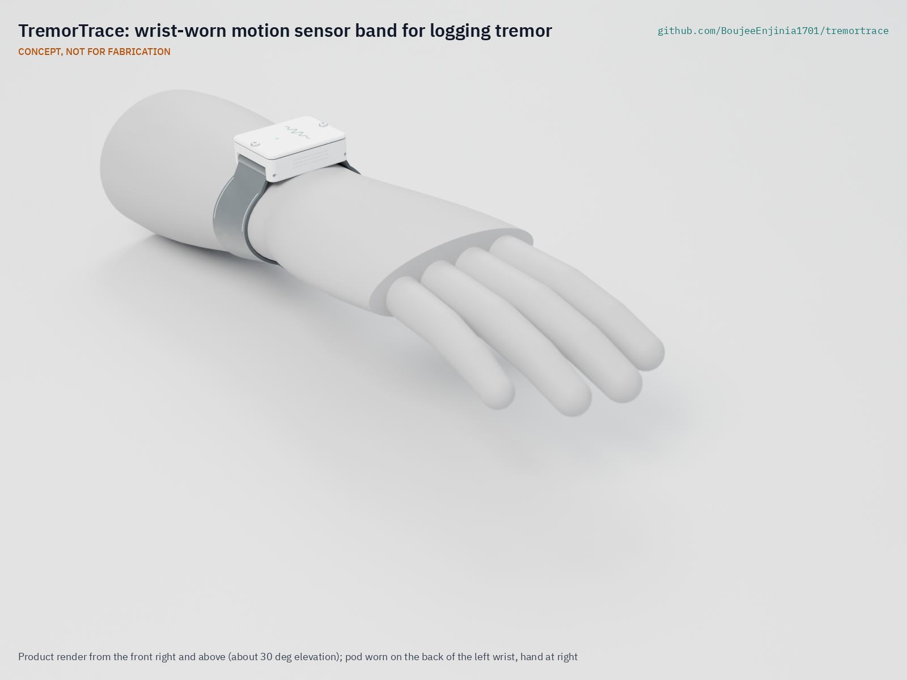
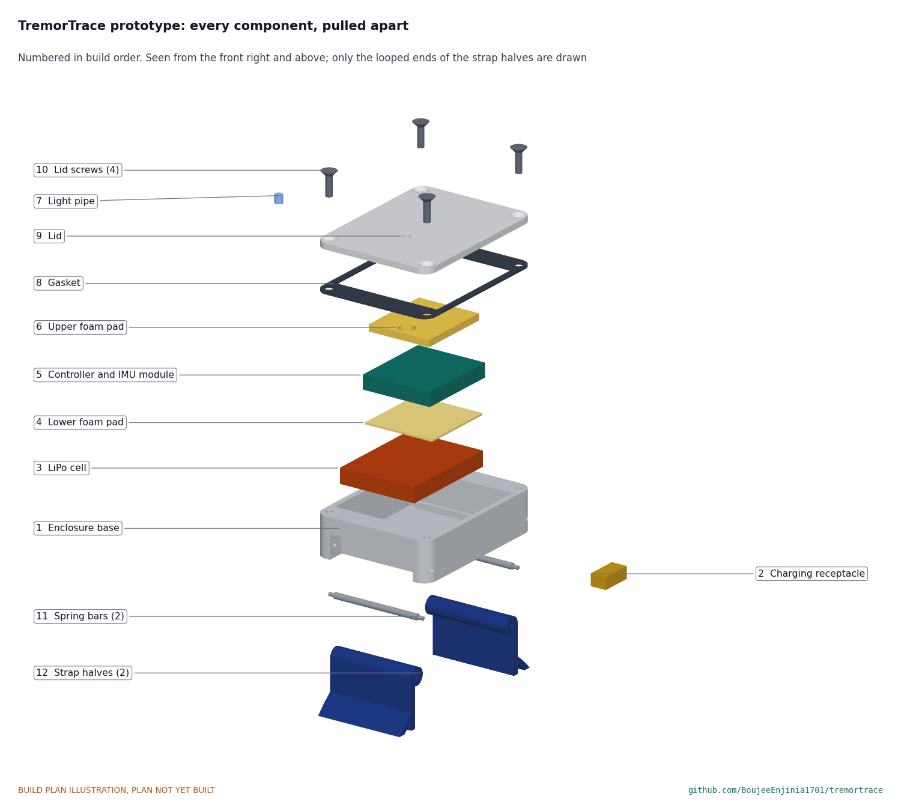

# TremorTrace

     

**Area:** BioMedical · **TRL:** 3 of 9 (proof of concept by calculation) · **Value-engineering target:** USD 150 (estimated cost USD 43.69) · **Difficulty:** 2 of 5

Wrist-worn IMU band that logs tremor frequency and amplitude continuously, with an open analysis notebook that produces a daily tremor profile.

[Exploded render](media/render-exploded.png) · [Detail render](media/render-detail.png) · [Interactive 3D model](media/viewer.html) · [Concept blueprint (PDF)](media/concept-blueprint.pdf) · [General arrangement (PDF)](cad/drawings/TRT-DWG-002.pdf) · [Calculations](docs/04-calcs/01-sizing.md) · [Prototype build plan](docs/05-build-plan.md) · [Design decisions](docs/06-design-decisions.md) · [Review note](docs/REVIEW.md)

## Concept rationale

Research groups have shown that a wrist-worn inertial sensor can follow tremor frequency and amplitude through a normal day, but most of that capability sits inside closed products or a single phone ecosystem. TremorTrace takes the smallest workable path: one off-the-shelf module with a built-in six-axis IMU, a coin-sized cell and a printed pod on a standard 22 mm watch strap. The band reduces each 10 s window to a 32-byte summary and keeps it on the wearer's own devices, so the data volume stays small and the privacy model stays simple.

Being open and garage-buildable matters because the people who most need a daily tremor record, and the researchers who want to study it, rarely control the tools. A design that costs about USD 44 in parts, needs no custom circuit board and publishes its analysis notebook can be built, inspected and adapted by a university lab, a patient group or a maker space anywhere. It is a research and educational prototype, not a medical device.

## Burning platform

Parkinson's disease is growing quickly. The [World Health Organization](https://www.who.int/news-room/fact-sheets/detail/parkinson-disease) estimates that over 8.5 million people were living with it in 2019 and that its prevalence has doubled in the past 25 years. Essential tremor is more common still: a worldwide meta-analysis put its pooled prevalence at 0.9 % at all ages and 4.6 % at age 65 and over ([Louis and Ferreira, Movement Disorders, 2010](https://movementdisorders.onlinelibrary.wiley.com/doi/10.1002/mds.22838)).

The specialists who judge tremor are scarce and unevenly spread. The WHO and World Federation of Neurology atlas found a median of 0.1 neurologists per 100,000 people in low-income countries against 7.1 in high-income countries ([WFN, 2017](https://wfneurology.org/2017-09-18-wcn-press-release-neurology-atlas)). Where a visit comes every few months, or not at all, a short observation in the room is all the evidence there is about how tremor behaves across a day.

## Where it could be used

### By industry

| Industry | Use |
| --- | --- |
| University research | Open, inspectable reference sensor for studies of tremor variation at home |
| Clinical research | Exploratory daily tremor profiles alongside established rating scales and diaries in research studies |
| Patient associations | Low-cost kits for members who want to see and share their own daily patterns |
| Biomedical engineering education | Teaching sampling, spectral analysis, power budgets and privacy-by-design on a real wearable |
| Open hardware and maker spaces | A reproducible wearable platform to adapt for other movement research |

### By country or region

| Country or region | Why it matters there |
| --- | --- |
| Netherlands | ParkinsonNet, founded in 2004, links about 3,000 allied health professionals in 69 regional networks ([Commonwealth Fund, 2016](https://www.commonwealthfund.org/publications/case-study/2016/dec/parkinsonnet-innovative-dutch-approach-patient-centered-care)); community therapists could use shared daily profiles between neurology visits |
| United States | Clinical trials have long used half-hourly home diaries to count daily motor states ([Hauser et al., 2000](https://pubmed.ncbi.nlm.nih.gov/10803796/)); an open sensor record gives researchers a comparison |
| China | A community survey found Parkinson's prevalence of 1.37 % above age 60, about 3.62 million people ([Qi et al., Movement Disorders, 2021](https://movementdisorders.onlinelibrary.wiley.com/doi/10.1002/mds.28762)) |
| Sub-Saharan Africa | The WHO African region reported about 0.1 neurologists per 100,000 people ([WFN, 2017](https://wfneurology.org/2017-09-18-wcn-press-release-neurology-atlas)); a low-cost local record can support the few specialist reviews available |
| India | The burden of non-communicable neurological disorders, Parkinson's disease among them, is rising mainly because the population is ageing, and the national study calls for addressing a shortage of trained neurologists ([ICMR, PHFI and IHME, 2021](https://www.icmr.gov.in/icmrobject/custom_data/1702892885_press_release_gbd_india_neurological_disorders_14072021.pdf)); a band built from widely sold modules suits university and community research groups |

## What sparked the idea

The starting point was the Parkinson's disease home diary developed by Robert Hauser and colleagues in 2000, in which people mark their predominant state for every half hour of the day on paper ([Hauser et al., Clinical Neuropharmacology, 2000](https://pubmed.ncbi.nlm.nih.gov/10803796/)). The diary was built as a patient-reported outcome for clinical trials and is still being validated today ([Löhle et al., npj Parkinson's Disease, 2022](https://www.nature.com/articles/s41531-022-00331-w)), and it shows both how much a day-long record is valued and how much it asks of the person keeping it. TremorTrace asks the same question of a wrist sensor instead: it writes a small entry every 10 seconds without any effort from the wearer and leaves the record in the wearer's hands.

## Problem

Tremor severity is scored during short clinic visits, which misses how it varies day to day.

## Concept

Wrist-worn IMU band that logs tremor frequency and amplitude continuously, with an open analysis notebook that produces a daily tremor profile.

Full design precis: [docs/02-concept.md](docs/02-concept.md)

## Key components

- Seeed XIAO nRF52840 Sense class module (nRF52840 BLE, 6-axis IMU, 2 MB flash, charger)
- 150 mAh protected LiPo cell
- Printed PETG enclosure with TPU gasket, 40 x 30 x 12 mm
- 22 mm woven textile strap, about 8 g

The priced bill of materials (USD 43.69 in parts, against a USD 150 value-engineering target) is in [bom/bom.csv](bom/bom.csv).

## Status at TRL 3

Calculations in [TRT-CAL-001](docs/04-calcs/01-sizing.md) show 0.1 Hz frequency resolution, 4.5 to 6.3 days per charge and 9.7 days of on-band history. Mass is 26.2 g against a 30 g limit with the textile strap adopted under [TRT-DDR-002](docs/decisions/0002-recommendations-accepted.md). The parametric model is [cad/src/model.py](cad/src/model.py) and the general arrangement is [TRT-DWG-002](cad/drawings/TRT-DWG-002.pdf), Rev P3. The design is constructable: every part can be made and fixed as drawn ([TRT-DDR-003](docs/decisions/0003-design-for-construction.md)). TRL 4 work is on hold.

## Building the prototype

The [prototype build plan](docs/05-build-plan.md) (TRT-BLD-001) shows, in pictures, how to make each of the twelve components and put them together in nine steps; nothing has been built yet. The base, lid and gasket are 3D printed, two foam pads are cut from sheet, and the module, cell, charging receptacle, screws, spring bars and strap are bought; the electronics are four soldered wires. Writing the plan made the design buildable: the spring bar holes, lid screws and strap notches were redesigned, and cell ribs, a glue collar for the charging receptacle and foam pads that let the lid clamp the stack were added (TRT-DDR-003, open for Amish's review). Every picture is drawn from the model, and the model checks that each part touches what it should and clears what it should not.

## Safety

> This is a research and educational prototype. It is not a medical device, has not been cleared or approved by any regulator, and must not be used to diagnose, treat or monitor any person.

## Repository layout

| Folder | Contents |
| --- | --- |
| `docs/` | Problem, concept, requirements, calculations, build plan and design decisions |
| `cad/src/` | build123d Python source, the source of truth for all geometry |
| `cad/step/`, `cad/stl/` | Exported models for FreeCAD, other CAD tools and printing |
| `cad/drawings/` | 2D sketches and dimensioned drawings |
| `bom/` | Bill of materials |
| `electronics/` | KiCad schematics and PCB layouts |
| `firmware/` | Microcontroller code |
| `media/` | Renders, perspectives and photos |
| `build-log/` | Dated prototyping notes |

## Documentation

Controlled documents follow the portfolio [documentation standard](.kit/STANDARDS.md). Each carries a document ID (TRT-PRC-001 for the precis), a version and a revision history. Branded PDFs are built with `python .kit/render.py` and attached to GitHub Releases when a document is tagged, for example `TRT-PRC-001/v1.0`.

## Credits

Designed by Amish Chadha, with contributions from Dr. Geeti Chadha. See [CONTRIBUTORS.md](CONTRIBUTORS.md) for roles. To cite this design, use [CITATION.cff](CITATION.cff) (GitHub shows it as "Cite this repository").

AI assistance (Claude) was used to accelerate concept renders, prototype documentation and first-pass sizing calculations. Design direction and all decisions are Amish Chadha's, recorded in this repository's decision records (`docs/decisions/`).

## Licenses

- **Hardware** (CAD, drawings, BOM, electronics): [CERN-OHL-S v2](LICENSE)
- **Software** (firmware, scripts, notebooks): [MIT](LICENSE-SOFTWARE)

A project of the [Design Molecule](https://designmolecule.com) lab.
