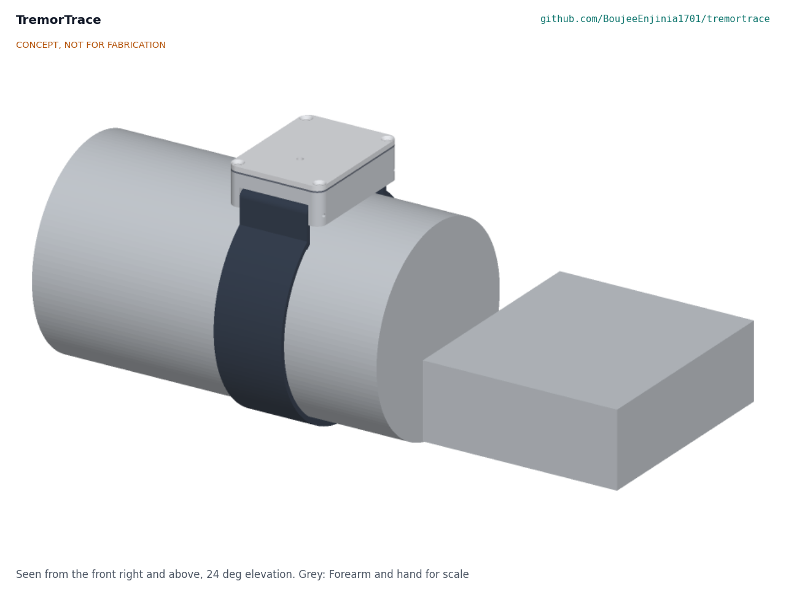
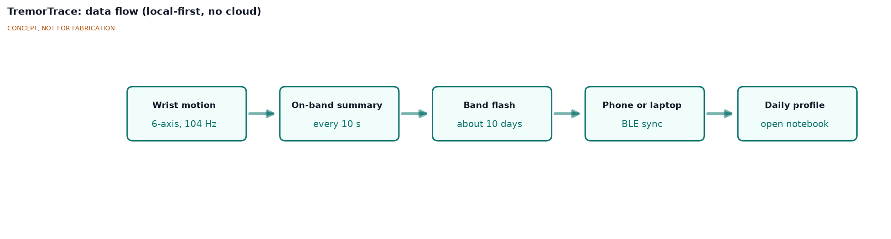
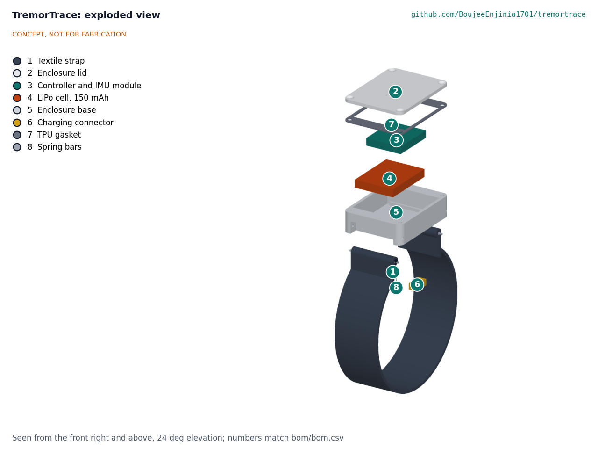

# TremorTrace design precis

TremorTrace is a small wrist pod on a watch strap that records wrist motion all day, turns it into 10-second tremor summaries on the band, and hands them to an open notebook that draws a daily tremor profile. The TRL 3 calculations (TRT-CAL-001) show that one off-the-shelf module and a 150 mAh cell meet nine of eleven requirements for USD 43.69 in parts, including mass at 26.2 g against a 30 g limit with a textile strap; splash resistance and the notebook can only be verified with hardware and software work.

## How it works

1. **Sense.** A 6-axis IMU (accelerometer and gyroscope) samples wrist motion at 104 Hz, with ranges of +/-8 g and +/-2000 dps.
2. **Summarize on the band.** Every 10 seconds the firmware band-pass filters the signal to 3 to 15 Hz, runs a spectrum, and stores a 32-byte summary: dominant frequency, band RMS of acceleration and angular velocity, total RMS, a band-to-low-frequency power ratio and an activity flag. Tremor values are kept even when the flag says the wearer was moving, so tremor during activity is not lost.
3. **Store.** Summaries go to the module's 2 MB flash, enough for 9.7 days at 16 h of wear per day without a phone. A 256 kB area holds up to 21 raw 10 s snippets captured on demand for research.
4. **Sync.** When the owner opens the web Bluetooth page or a laptop script, summaries transfer over Bluetooth Low Energy. Nothing goes to the cloud.
5. **Analyze.** An open Python notebook turns summaries into a daily profile: minutes of tremor per hour, dominant frequency and amplitude over the day, and optional medication-time markers entered by the owner.

## Main components

Table 1. Main components; item numbers match `bom/bom.csv` and the exploded view.

| # | Component | Choice | Notes |
| --- | --- | --- | --- |
| 1 | Strap | 22 mm woven textile two-piece quick-release strap | Skin-safe and washable; the heaviest part (about 8 g, assumed). Replaced the 12 g silicone strap; decided by Amish, 2026-09-25 (TRT-DDR-002) |
| 2 | Enclosure lid | 3D-printed PETG, 1.5 mm, four M2 countersunk screws, one in each lug horn | 2 mm light pipe over the module's status LED |
| 3 | Controller and IMU | Seeed XIAO nRF52840 Sense class: nRF52840, LSM6DS3TR-C IMU, 2 MB flash, BQ25101 charger | One module, no custom PCB. Decided by Amish, 2026-09-25 (TRT-DDR-001) |
| 4 | Battery | 150 mAh protected LiPo, 19.75 x 26.02 x 3.8 mm (Adafruit 1317 class) | See power budget |
| 5 | Enclosure base | 3D-printed PETG with integrated 22 mm lugs, cell locating ribs and a glue collar | Charging connector glued through the floor |
| 6 | Charging contacts | Magnetic 2-pin pogo connector | Keeps the enclosure sealed |
| 7 | Gasket | Printed TPU ring, 0.5 mm compressed | Toward the IP54 target (R7) |
| 8 | Spring bars | 22 mm | Hold the strap in the lugs |

## Key numbers

All values come from TRT-CAL-001 and the parametric model in `cad/src/model.py`.

Table 2. Key numbers at TRL 3.

| Quantity | Value | Requirement |
| --- | --- | --- |
| Frequency resolution | 0.100 Hz bins (10 s at 104 Hz) | R1 (0.2 Hz) met, with sample-rate correction |
| Nyquist limit | 52 Hz | R1, R3 met |
| In-band noise | 0.31 mg and 0.017 dps RMS | R2 met |
| Recording current | 1.12 mA nominal, 1.54 mA conservative | |
| Battery life | 6.3 days nominal, 4.5 days conservative | R4 (3 days) met, if the firmware sleeps |
| Summary storage | 184.3 kB per day (32 bytes per 10 s, 16 h) | |
| On-band history | 9.7 days | R5 (7 days) met |
| Pod size | 40 x 30 x 12 mm | R6 size met |
| Mass | 26.2 g with textile strap | R6 (30 g) met, 3.8 g margin |
| Parts cost | USD 43.69, USD 106.31 under the USD 150 value-engineering target | R10 met |

The general arrangement is drawing TRT-DWG-002 (`cad/drawings/TRT-DWG-002.pdf`), Rev P3. How to build the prototype is in the build plan TRT-BLD-001 (`docs/05-build-plan.md`); the changes that made the design buildable are in TRT-DDR-003.

## Key design choices

- **Summaries, with optional raw snippets.** A 32-byte summary is 390 times smaller than the 12,480 bytes of raw data in a 10 s window, and it keeps personal data minimal. Decided by Amish, 2026-09-25 (TRT-DDR-001).
- **One module, no custom PCB.** Keeps the first build within reach of anyone with a soldering iron and a 3D printer. Decided by Amish, 2026-09-25 (TRT-DDR-001).
- **Web Bluetooth page first.** No app store and no account; a native app may follow. Decided by Amish, 2026-09-25 (TRT-DDR-001).
- **Local-first data.** No cloud account is needed to use or analyze the data (R9). Decided by Amish, 2026-09-25 (TRT-DDR-001).
- **Most affected wrist first.** Decided by Amish, 2026-09-25 (TRT-DDR-001).
- **Charge current 50 mA.** Charges in about 3.6 h with about 65 mW of charger heat, against 1.8 h and 130 mW at 100 mA. The firmware selects the 50 mA setting. Decided by Amish, 2026-09-25 (TRT-DDR-002).
- **Textile strap.** A woven textile strap of about 8 g replaces the 12 g silicone strap and raised the R6 mass margin from 0.6 g to 4.6 g (3.8 g after the parts added for construction). Decided by Amish, 2026-09-25 (TRT-DDR-002).

## Safety

> **Safety:** Research and educational prototype only. It is not a medical device, has not been cleared or approved by any regulator, and must not be used to diagnose, treat or adjust medication.

- The LiPo cell sits against the skin: use a protected cell, never charge while worn, charge at no more than the cell's 150 mA limit, and stop use if the pod becomes warm or swollen.
- Use skin-safe strap materials and check for irritation during long wear.
- Tremor data is health data. Keep it on the owner's devices and share only with consent.

## Open questions

- The activity flag marks tremor during a reach as activity in synthetic data (TRT-CAL-001, section 4). How well can action tremor be separated from voluntary movement with 10 s summaries?
- Confirm the IMU sample-rate tolerance, the module's run current and the textile strap mass.
- First clinical or patient partner for co-design and eventual validation. Proposed, awaiting Amish.

Open decisions are tracked in the design decisions register, TRT-DEC-001 (`docs/06-design-decisions.md`).

Concept media: [blueprint sheet](../media/concept-blueprint.pdf), [interactive 3D model](../media/viewer.html).
