# TremorTrace prototype build plan

**Plan, not yet built.** How to build the first proof-of-concept prototype, component by component. Building and testing to it is TRL 4 work. Decisions still to be made are kept in the design decisions register ([docs/06-design-decisions.md](06-design-decisions.md)), not here.

> **Safety:** TremorTrace is a research and educational prototype, not a medical device. It has not been cleared or approved by any regulator and must not be used to diagnose, treat or monitor any person. It holds a small lithium polymer cell that sits against the skin: use a protected cell, never charge the band while it is worn, charge only at the 50 mA setting, and stop using it if the pod becomes warm or swollen.

## 1. What you are building

*Figure 1. Every component pulled apart and numbered in build order; only the looped ends of the two strap halves are drawn.*

The prototype is one TremorTrace band: a small printed pod, 30 mm along the forearm, 40 mm across the wrist and 12 mm high, on a standard 22 mm two-piece watch strap. Inside the pod a bought module (which carries the motion sensor, radio, memory, charger and status light) sits on a flat 150 mAh cell, with a foam pad above and below so the lid clamps the stack. A magnetic charging receptacle is set into the floor, and a short clear rod in the lid carries the status light out. Figure 1 shows the 13 components in the order you make or fit them. Four are made: the base, the lid with its light pipe and the gasket are 3D printed, and the two foam pads are cut from sheet. The rest are bought and fitted: the module, cell, receptacle, screws, spring bars and strap. The work is printing PETG and TPU, drilling small holes by hand, cutting foam, soldering four wires and one small diode and mixing a little epoxy. The parts cost about USD 44 from the bill of materials.

## 2. What changed to make it buildable

The concept showed what the band does; some of its parts could not be made or fixed as drawn. Each change below keeps what the band does, and all of them are recorded in decision record TRT-DDR-003, open for Amish's review.

*Table 1. Changes from the concept.*

| Component | The concept had | The buildable design has | Why |
| --- | --- | --- | --- |
| Spring bar holes | 1.8 mm holes, wider than the 1.5 mm bar body | 1.0 mm holes that take only the bar's thin tips (Figure 5) | The bar can no longer slide sideways and drop out |
| Lid screws | Two screws on the centre line, right above the strap notches, with no plastic below the screw tips | Four countersunk screws, one in each solid corner (lug horn), 4 mm of thread each (Figure 8) | Solid plastic to screw into; the gasket is squeezed at all four corners; the heads sit flush |
| Strap notches | 4.0 mm deep; the strap loop rubbed the inner face | 4.5 mm deep (Figure 5) | The looped strap end swings freely, 0.35 mm clear |
| Charging receptacle | Sat in a floor hole with no fixing | A printed collar round the hole, filled with epoxy (Figure 4) | The epoxy both holds and seals the only hole through the skin side |
| Cell | Free to slide inside the pod | Three low printed ribs make a pocket 0.3 mm larger than the cell (Figure 3) | The cell stays put and the wires have room beside it |
| Module | Floated with a 1.7 mm gap under the lid | A 2 mm foam pad above it, squeezed by the lid (Figure 7) | The lid clamps the whole stack; nothing rattles |
| Charging receptacle lead | Receptacle wired straight to the module's 5 V and ground pins | A small Schottky diode in the receptacle's red lead, glued to the floor beside the collar (Figure 11) | The contacts touch the skin; the diode blocks any voltage from the module reaching them |
| Cell plug | A plug with no room for it in the pod | Plug cut off; leads soldered to the module's battery pads (Figure 11) | Nothing bulky in the 9.5 mm high cavity |
| Light pipe and gasket | A bore with no rod; a gasket drawn only squeezed | A 2 mm clear rod set in epoxy; a gasket printed 0.8 mm thick that squeezes to 0.5 mm | Every part is now drawn and checked for fit |

## 3. Making the components

Make and check each component before the assembly step that needs it. Sizes are in millimetres. The pod's "hand end" and "elbow end" are its two short sides along the forearm; its "strap ends" are the two 30 mm faces where the strap fits. Printing tolerance is about 0.2 mm; open every small hole with a drill rather than trusting the printed size. Drawings do not carry tolerances before TRL 4.

### 3.1 Enclosure base

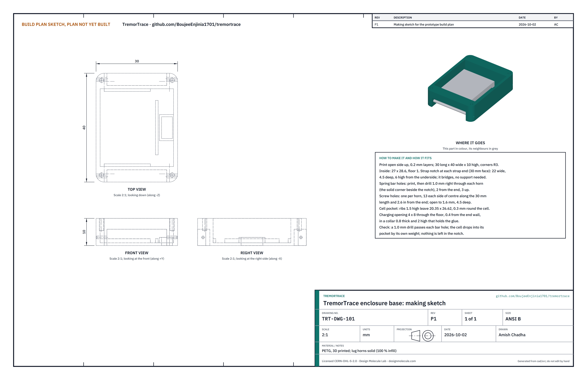

*Figure 2. Enclosure base making sketch (TRT-DWG-101).*

**What it is and what it is made from.** The open box that holds everything, with the two strap lugs built in. PETG, 3D printed, 30 x 40 x 10 mm with 3 mm rounded corners, walls 1.5 thick and a 1 mm floor. The four solid corners beside the strap notches (the lug horns) must print solid.

**How to make it.**

1. Print open side up, 0.2 mm layers, at least four walls, with the lug horns at 100 % infill (use a modifier, or 100 % infill for the whole part). The strap notch at each strap end, 22 wide, 4.5 deep and 6 high from the underside, bridges without support.
2. Inside the box, check the cell pocket printed clean: three ribs 1.5 high and 1 wide (one across the box toward the hand end, one along each long side) which with the elbow-end wall leave a pocket 20.35 x 26.62.
3. Check the 4 x 8 charging opening through the floor at the hand end, 0.4 from the end wall, inside a collar 0.8 thick and 2 high. Clear any stringing from the opening.
4. Spring bar holes: with a 1.0 mm drill in a pin vise, drill right through each lug horn along the forearm, 2 from the strap end and 3 up from the underside. Drill from the outside of each horn toward the notch.
5. Screw holes: one in the top of each lug horn, 13 each side of the centre along the forearm and 2.6 in from the strap end. Open each to 1.6 mm, 4.5 deep. Do not go deeper; the spring bar hole is 2 mm below.
6. Deburr every hole with a sharp blade.

**How it fits the parts next to it.**

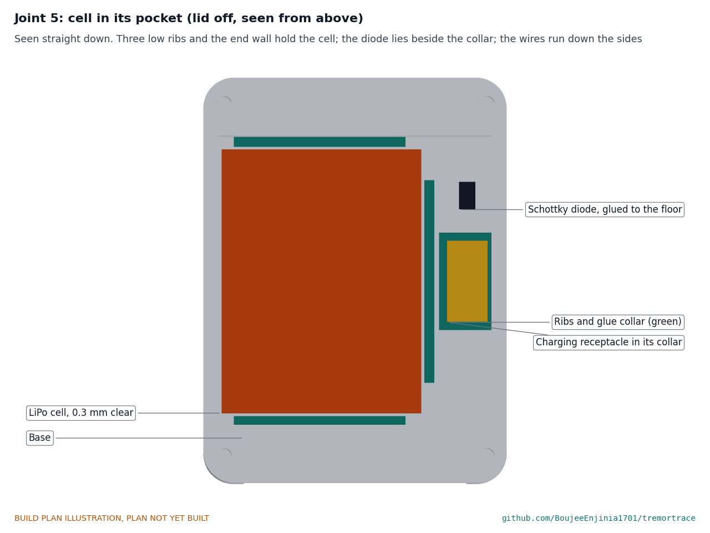

*Figure 3. The cell drops into the pocket made by the three ribs and the elbow-end wall, 0.3 mm clear all round; the receptacle sits in its collar at the hand end.*

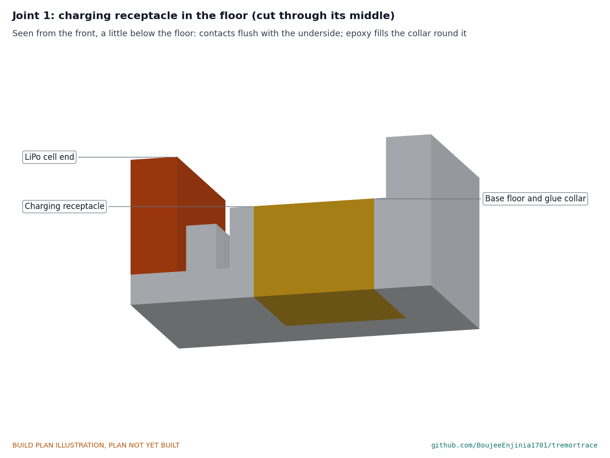

*Figure 4. The receptacle goes up through the floor opening with its contacts flush with the underside; epoxy fills the collar round it.*

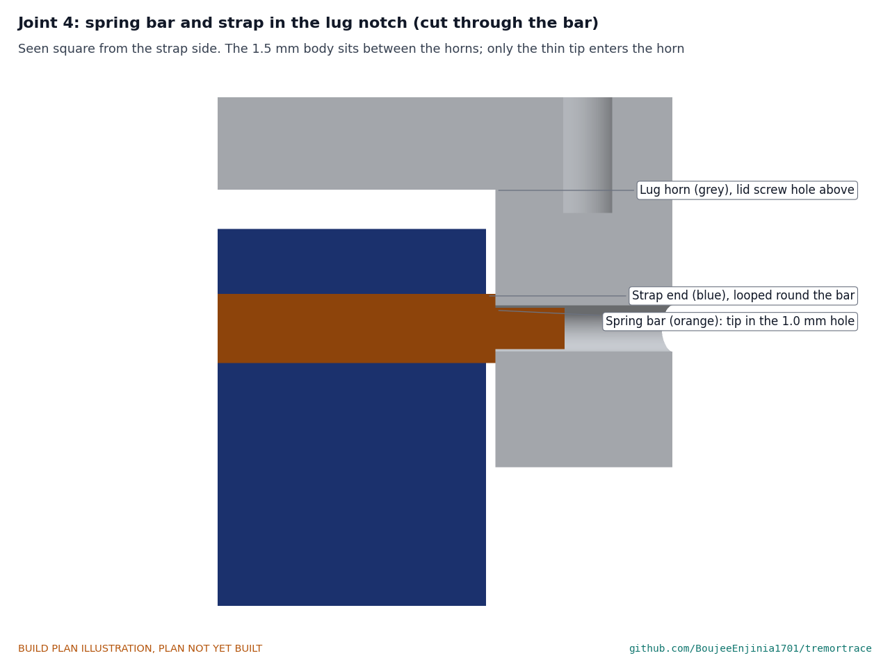

*Figure 5. The bar's body sits between the horns; only its thin tip goes into the 1.0 mm hole. The strap end loops round the bar inside the notch.*

**Check before moving on.** A 1.0 mm drill passes each spring bar hole; a 1.6 mm drill reaches 4.5 deep in each screw hole; the cell drops into its pocket under its own weight; nothing is left in the notches or the opening.

### 3.2 Lid and light pipe

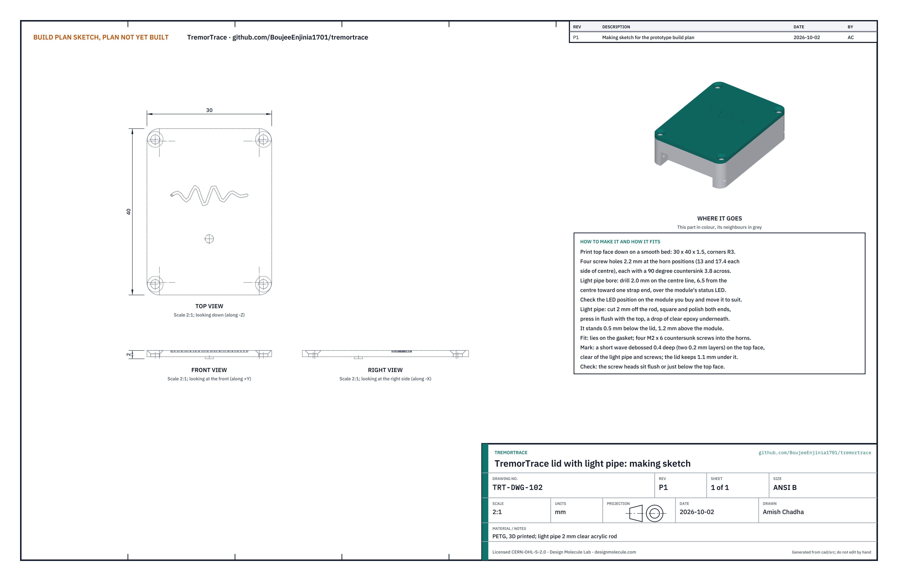

*Figure 6. Lid with light pipe making sketch (TRT-DWG-102).*

**What it is and what it is made from.** The flat cover, with four countersunk screw holes and a clear rod that carries the status light out. PETG, 3D printed, 30 x 40 x 1.5 mm with 3 mm corners; the light pipe is a 2 mm length of 2 mm clear acrylic rod.

**How to make it.**

1. Print top face down on a smooth bed so the outside is smooth. Four screw holes 2.2 across at the lug horn positions, each with a 90 degree countersink 3.8 across on the top face.
2. Light pipe bore: drill 2.0 mm on the centre line, 6.5 from the centre toward one strap end, over the module's status light. Check the light's position on the module you have and move the bore to suit.
3. Cut 2 mm off the acrylic rod with a fine saw; square and polish both ends on fine abrasive paper.
4. Fit the light pipe as step 6 describes.

**How it fits the parts next to it.**

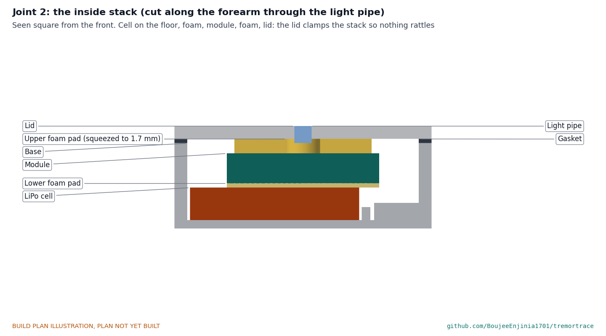

*Figure 7. Cut along the forearm through the light pipe: cell, lower pad, module, upper pad and lid. The light pipe stands 0.5 below the lid and 1.2 above the module.*

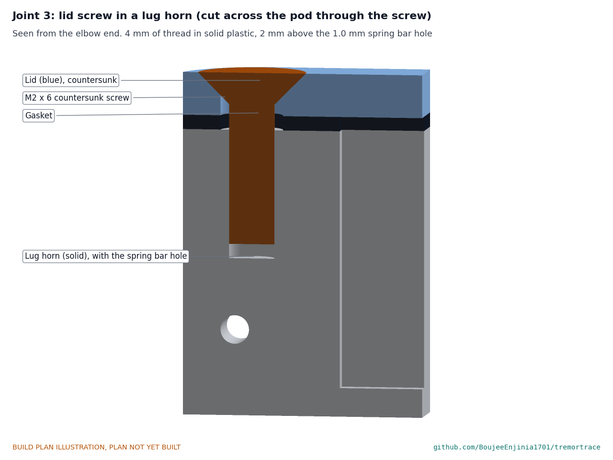

*Figure 8. Cut across the pod through a screw: the screw passes through the lid and gasket into 4 mm of solid horn, 2 mm above the spring bar hole.*

The lid lies on the gasket, and the gasket on the base rim; four M2 x 6 countersunk thread-forming screws go through both into the horns. The upper foam pad presses up against the lid's underside.

**Check before moving on.** The light pipe is flush with the top face and clear from end to end; a test screw head sits flush or just below the top face.

### 3.3 Gasket

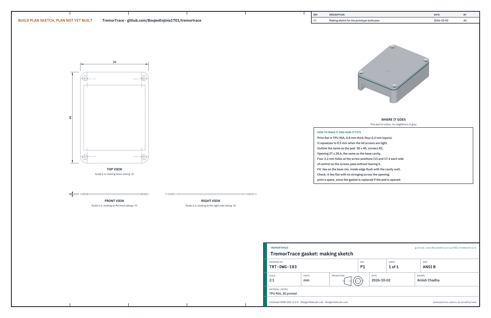

*Figure 9. Gasket making sketch (TRT-DWG-103).*

**What it is and what it is made from.** The soft ring between the base rim and the lid that keeps splashes out. TPU 95A, 3D printed, 0.8 mm thick, which the lid screws squeeze to 0.5 mm.

**How to make it.**

1. Print flat, four layers of 0.2 mm, slowly (TPU prints best from a direct-drive extruder).
2. Outline 30 x 40 with 3 mm corners, the same as the pod; opening 27 x 28.6, the same as the inside of the base.
3. Four 2.2 mm holes at the screw positions, 13 and 17.4 each side of the centre.
4. Print a spare: a gasket is replaced whenever the pod is opened.

**How it fits the parts next to it.** It lies on the base rim with its inside edge flush with the inside wall and its holes over the screw holes (Figure 8).

**Check before moving on.** It lies flat, with no stringing across the opening and no gaps in the ring.

### 3.4 Foam pads (lower and upper)

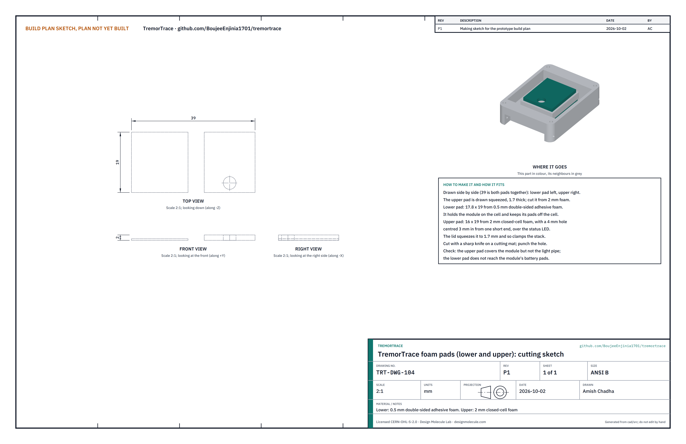

*Figure 10. Foam pads cutting sketch (TRT-DWG-104).*

**What they are and what they are made from.** Two pads that hold the module: a lower pad of 0.5 mm double-sided adhesive foam that sticks the module to the cell, and an upper pad of 2 mm closed-cell foam that the lid squeezes to 1.7 mm.

**How to make them.**

1. Lower pad: cut 17.8 x 19 with a sharp knife on a cutting mat.
2. Upper pad: cut 16 x 19, and punch a 4 mm hole centred on the long centre line, 3 in from one short end.

**How they fit the parts next to them.** The lower pad covers the cell under the module but stops short of the module's battery pads. The upper pad sits on the module with its hole over the status light, so the light pipe looks straight down at the light (Figure 7).

**Check before moving on.** Laid on the module, the upper pad covers it without hanging over its edges, and the hole sits over the status light.

### 3.5 Bought components

Buy to specification, not brand. Line numbers are those of the bill of materials.

- **Controller and motion sensor module (line 3).** nRF52840 module with a six-axis motion sensor, 2 MB flash, a single-cell charger with a 50 mA setting, battery pads and a status light, about 21 x 17.8 x 3.5 mm (XIAO nRF52840 Sense class).
- **Cell (line 4).** 150 mAh lithium polymer, 3.7 V, with its own protection circuit, about 19.75 x 26.02 x 3.8 mm, from a maker that publishes a datasheet and allows charging at 150 mA or less.
- **Charging receptacle (line 6).** Two-contact magnetic receptacle about 4 x 8 x 3 mm, sold with its matching USB charging cable.
- **Schottky diode (line 12).** SOD-123 surface-mount or similar small part, 1 A, 30 V or higher, forward drop 0.4 V or less at 50 mA; glued to the base floor and soldered into the receptacle's red lead.
- **Lid screws (line 9).** Four M2 x 6 countersunk thread-forming screws for plastics, stainless.
- **Spring bars (line 8).** 22 mm quick-release bars with a 1.5 mm body and tips of about 0.9 mm (one pair usually comes with the strap; keep the spare pair).
- **Strap (line 1).** 22 mm two-piece quick-release woven textile strap, skin-safe and washable, about 8 g.
- **Light pipe (line 10).** 2 mm clear acrylic rod.
- **Consumables (line 11).** 0.5 mm double-sided adhesive foam, 2 mm closed-cell foam, 26 AWG stranded silicone wire in red and black, 1.5 mm heat shrink, polyimide tape, clear two-part epoxy.

## 4. Putting it together

In each picture the parts already fitted are grey and the part being fitted is in colour, with an arrow showing the way it goes in. Step 3 is wiring, shown as a diagram.

### Step 1: charging receptacle into the floor

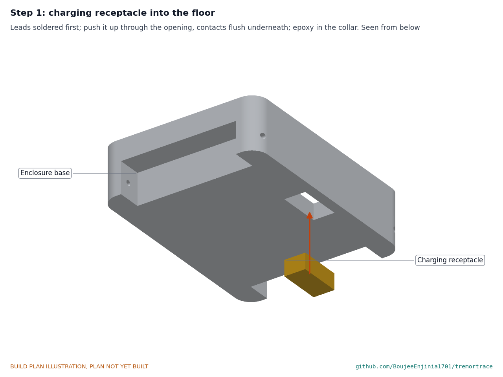

Solder a 40 mm red lead to the receptacle's positive contact and a black lead to its negative contact. Cut the red lead 15 mm from the receptacle and solder the Schottky diode between the two pieces, with its marked end (the band) toward the module. Cover every joint with heat shrink. Feed the leads up through the floor opening from underneath and push the receptacle up until its contacts are flush with the underside. Fill the collar round it with clear epoxy, keeping epoxy off the contacts, and let it cure flat for the full time on the pack.

### Step 2: cell into its pocket

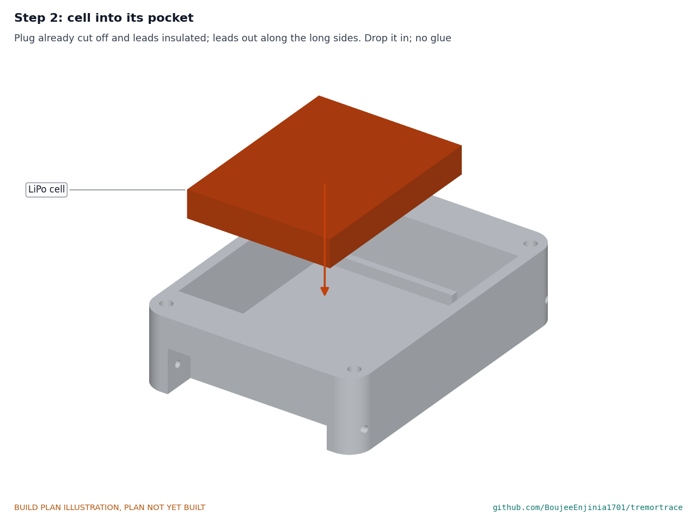

**Hold point:** safety stop S2. Cut the cell's plug off one lead at a time, never both together, and cover each bare end with tape until it is soldered. Drop the cell into its pocket with its leads coming out along a long side. No glue.

### Step 3: wire the module

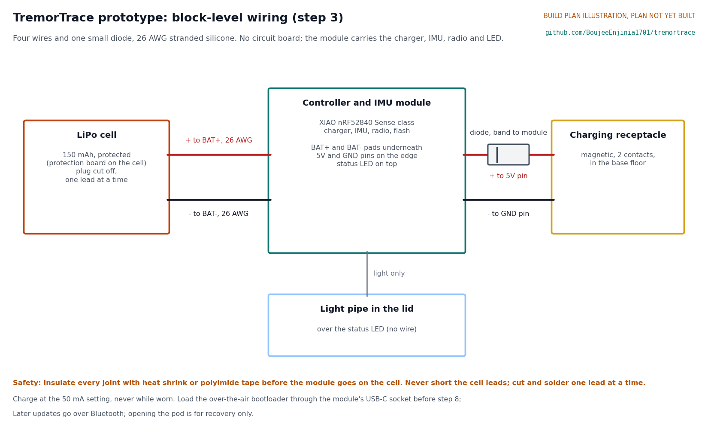

*Figure 11. Four wires and one diode: cell to the module's battery pads, receptacle through the diode to the module's 5 V pin and straight to its ground pin.*

With the module outside the pod, solder the cell's red lead to the battery positive pad and its black lead to the battery negative pad, one lead at a time; then the receptacle's red lead (the end beyond the diode) to the 5 V pin and its black lead to a ground pin. Keep each lead just long enough to reach with the module lifted out beside the pod. Cover every joint with heat shrink or polyimide tape. Load the over-the-air bootloader (and the first firmware) through the module's USB-C socket now, before the lid is closed: the socket is sealed inside once the lid is on. Later updates go over Bluetooth; opening the pod, with a new gasket, is for recovery only. **Hold point:** safety stops S3 and S4.

### Step 4: lower foam pad and module

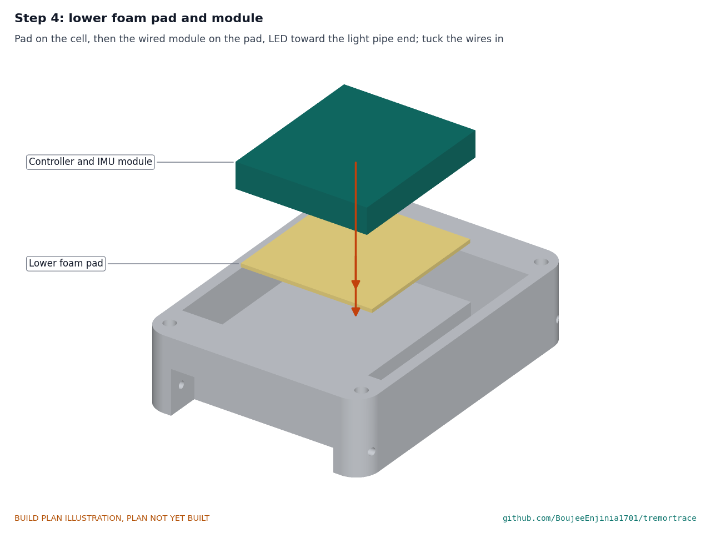

Stick the lower pad on the cell, peel its top liner, and press the wired module onto it, status light toward the strap end with the light pipe. Glue the diode flat on the floor beside the receptacle collar, 8.5 mm to one side of the opening, with a drop of epoxy, before the module goes in. Tuck the wires into the gaps beside the cell, clear of the gasket rim.

### Step 5: upper foam pad

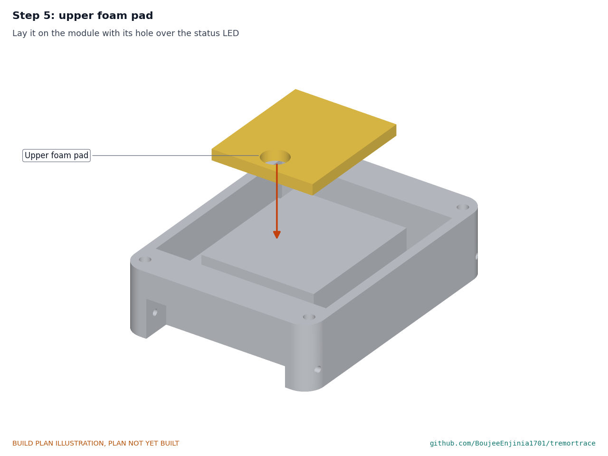

Lay the upper pad on the module with its hole over the status light.

### Step 6: light pipe into the lid

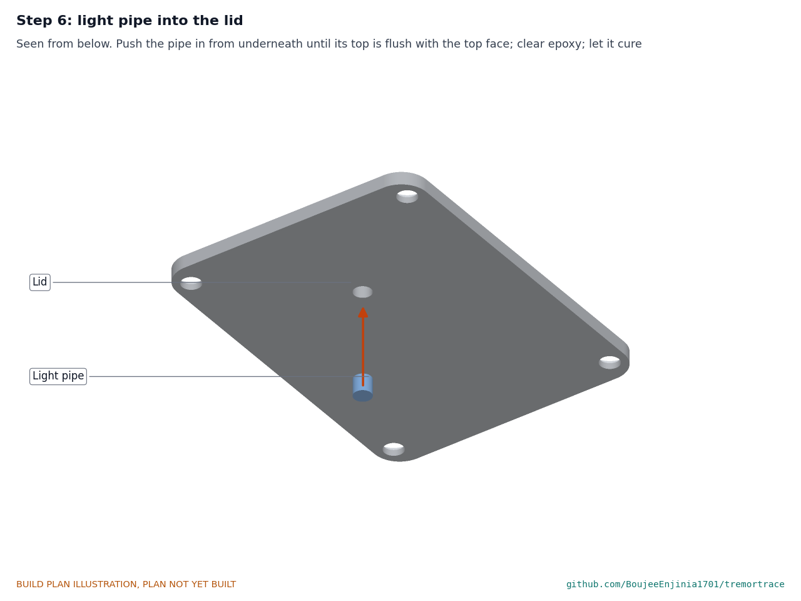

Lay the lid top face down on a smooth sheet. Push the light pipe into its bore from underneath until it touches the sheet (flush with the top face). Put a small drop of clear epoxy round it on the underside and let it cure.

### Step 7: gasket onto the rim

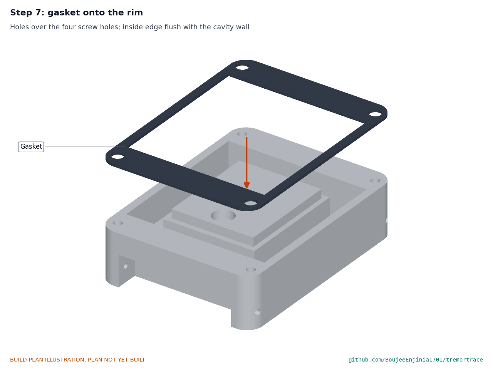

Lay the gasket on the base rim with its holes over the screw holes and its inside edge flush with the inside wall. **Hold point:** safety stop S5.

### Step 8: lid and four screws

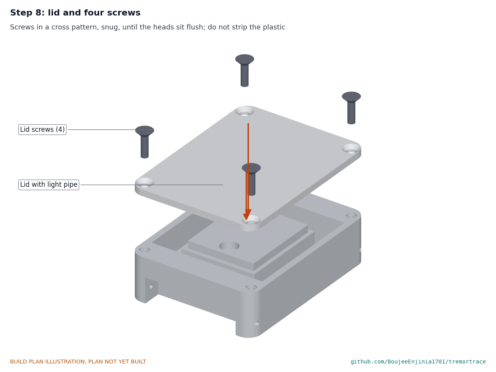

Place the lid, light pipe over the status light. Drive the four screws in a cross pattern, a turn or two at a time, until the heads sit flush. Stop as soon as they are snug: the thread is cut in plastic and strips if forced.

### Step 9: spring bars and strap halves

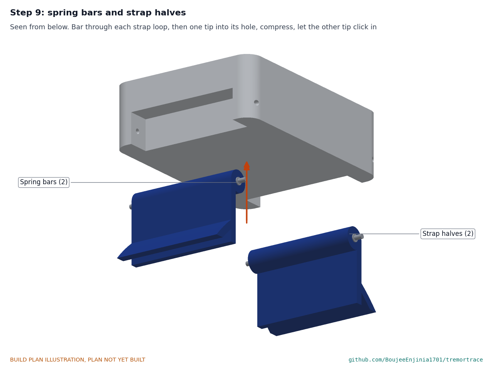

Pass a spring bar through each strap half's loop. Put one tip into its hole in a horn, compress the bar with a spring bar tool, line up the other tip and let it click into its hole. Pull each strap half firmly to check it is held. **Hold point:** safety stop S6 before the band is worn.

## 5. First checks

These are the checks a TRL 4 test report would record; this plan only lists them. Requirement numbers are those of TRT-REQ-001.

*Table 2. First checks.*

| Check | Requirement | How | Pass when |
| --- | --- | --- | --- |
| Size | R6 | Calipers over the closed pod | 45 x 35 x 14 mm or less (30 x 40 x 12 mm by design) |
| Mass | R6 | Weigh the finished band with its strap on a 0.1 g scale | 30 g or less (26.2 g estimated) |
| Strap held | R7 | Pull each strap half firmly by hand | Neither bar moves or comes out |
| Seal squeeze | R7 | Look at the gasket edge all round under a lamp | Evenly squeezed, no gap; screw heads flush (the splash test comes later) |
| Cell voltage at the module | R4 | Meter on the battery pads before the module is powered up | 3.0 to 4.2 V, correct polarity |
| Status light | R11 | Power the module from the cell; look at the lid | The light shows through the light pipe |
| Charging current | R4 | USB power meter in the charging cable, attended, on the charging spot of S1 | 60 mA or less, falling as the cell fills |
| Pod temperature while charging | R4, R7 | Touch thermometer on the lid every 15 minutes | Never above 40 °C |
| Contacts dead when not charging | R7 | Meter across the receptacle contacts with the cell connected and no charger | 0 V (see safety stop S6) |
| Sample rate | R3 | Read the sensor's sample count against the module's clock over 60 s | 104 Hz within the firmware's correction |

## 6. Safety stops

Stop at each point. Carry on only when everything listed is true.

- **S1. Before the cell comes into the workshop.** The cell has its own protection circuit and a datasheet from its maker; its voltage is 3.0 to 4.2 V; it has no swelling, dents or leaks. A charging spot is ready on a non-combustible surface (a ceramic tile or steel tray), away from anything that burns.
- **S2. Before the cell's plug is cut.** Cut one lead at a time and tape the bare end at once; never let the two leads touch, and never cut both together with one snip.
- **S3. Before the module is powered from the cell.** Check with a meter, not by wire colour, that the cell's positive lead goes to the battery positive pad and the receptacle's positive lead, through the diode, to the 5 V pin. The diode's marked end faces the module (check with the meter's diode range: it reads about 0.2 to 0.4 V from the receptacle toward the module and open the other way). Every joint is covered.
- **S4. Before the first charge.** The firmware has selected the 50 mA setting (or the module's default is confirmed as 50 mA). The first charge is attended the whole time, lid off, on the charging spot; the cell is checked by touch every 15 minutes. Stop if the cell becomes warm or swells. Never charge the band while it is worn.
- **S5. Before the lid goes on.** No wire crosses the gasket rim or presses on a sharp edge of the cell; the cell is seated flat in its pocket; nothing is pinched under the module.
- **S6. Before the band is worn.** The pod is closed and the screws are flush; the strap is held; the receptacle contacts read 0 V with no charger attached; the wearer understands this is a research and educational prototype, not a medical device. Check the skin under the band after the first hours of wear and stop if there is any redness, irritation or warmth.

## 7. Tools, skills and workspace

**Tools.** FDM 3D printer that prints PETG and TPU 95A (a direct-drive extruder makes TPU easier); pin vise with 1.0, 1.6 and 2.0 mm drills; sharp craft knife and cutting mat; 4 mm hole punch; fine saw and fine abrasive paper for the acrylic rod; temperature-controlled soldering iron with a fine tip, flux and thin solder; flush cutters and wire strippers for 26 AWG; heat gun or lighter for heat shrink; small Phillips driver for M2 screws; spring bar tool; multimeter; USB power meter; touch thermometer; calipers; scale reading to 0.1 g; mixing stick and cup for epoxy.

**Skills.** No certified trade is needed. Setting up a 3D print, careful hand drilling of small holes, fine soldering on small pads, and care with lithium cells. All circuits are extra-low voltage: 4.2 V at most at the cell and 5 V from the charging cable.

**Workspace.** A clean, well-lit bench about 0.6 x 0.4 m; a ventilated place for printing and soldering; the charging spot of S1.

**Personal protective equipment.** Safety glasses when cutting the cell's leads, soldering and drilling; nitrile gloves when mixing epoxy.

## 8. Where the numbers come from

- Model and constructability checks: `cad/src/model.py` (`python cad/src/model.py --check`, 38 checks); STEP and STL exports in `cad/step/` and `cad/stl/`.
- Pictures: `cad/src/build_plan_media.py`, using `.kit/build_views.py`; written to `docs/05-build-plan/` and `cad/drawings/TRT-DWG-101` to `TRT-DWG-104`.
- General arrangement: `cad/drawings/TRT-DWG-002.pdf`, Rev P3.
- Calculations: `docs/04-calcs/01-sizing.md` (TRT-CAL-001 v0.4) and `docs/04-calcs/sizing.py`; mass in section 7, charging in section 5.
- Bill of materials: `bom/bom.csv` and `bom/bom-notes.md`.
- Decisions: `docs/decisions/0003-design-for-construction.md` (TRT-DDR-003), with TRT-DDR-001 and TRT-DDR-002; open items in `docs/06-design-decisions.md` (TRT-DEC-001).
- Requirements: `docs/03-requirements.md` (TRT-REQ-001 v0.6).
